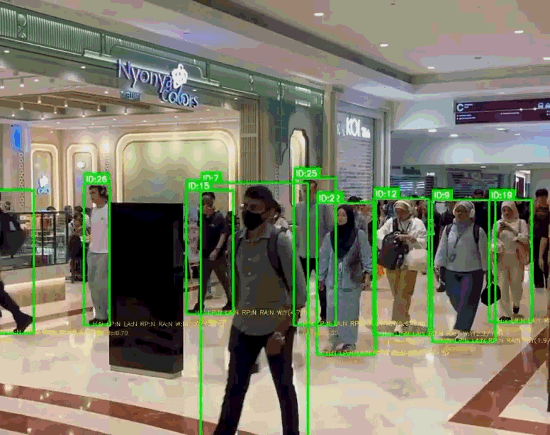

# Distracted Walking Detection using RF-DETR and YOLO Pose



An AI-powered computer vision system that detects pedestrians using mobile phones while walking in real time.

The system combines RF-DETR object detection, YOLO pose estimation, multi-person tracking, walking analysis, and temporal filtering to accurately identify distracted walking while reducing false positives.

---

## Features

- Real-time mobile phone detection using RF-DETR
- Human pose estimation using YOLO Pose
- Multi-person tracking
- Walking detection based on body movement
- Head orientation analysis
- Phone-to-hand association
- Temporal filtering and debounce logic
- Automatic evidence snapshot generation
- Configurable detection thresholds
- Debug visualization mode
- FPS monitoring

---

## Detection Pipeline

```
Video Input
      │
      ▼
RF-DETR Phone Detection
      │
      ▼
YOLO Pose Estimation
      │
      ▼
Person Tracking
      │
      ▼
Walking Detection
      │
      ▼
Head Orientation Analysis
      │
      ▼
Phone Near Wrist Check
      │
      ▼
Temporal Filtering
      │
      ▼
Violation Detection
      │
      ▼
Snapshot Saved
```

---

## Installation

Clone the repository

```bash
git clone https://github.com/D0tsy/Distracted_Walking_Detection.git
cd Distracted_Walking_Detection
```

Create a virtual environment

```bash
python -m venv venv
```

Activate the environment

Windows

```bash
venv\Scripts\activate
```

Linux / macOS

```bash
source venv/bin/activate
```

Install dependencies

```bash
pip install -r requirements.txt
```

---

## Required Models

This project requires pretrained model weights that are **not included** in this repository due to GitHub file size limits.

Place the following files in the project directory before running:

- yolo26l-pose.pt
- RF-DETR checkpoint (.pth)

---

## Usage

Run

```bash
python Detection_Riz_CUDA.py
```

---

## Output

The system produces:

- Live annotated video
- Output video (`output.mp4`)
- Violation snapshots inside the `violations` folder

Green bounding box

- Normal pedestrian

Red bounding box

- Distracted walking violation detected

---

## Configuration

Detection behaviour can be adjusted directly in `Detection_Riz_CUDA.py`.

Example parameters include

- Phone confidence threshold
- Head tilt threshold
- Walking threshold
- Phone expansion distance
- Temporal streak filtering
- Debounce frames
- Debug mode

---

## Technologies Used

- Python
- PyTorch
- OpenCV
- RF-DETR
- Ultralytics YOLO
- NumPy
- Supervision

---

## Future Improvements

- Live CCTV support
- Multi-camera tracking
- Azure deployment
- Web dashboard
- Performance optimization
- Improved occlusion handling
